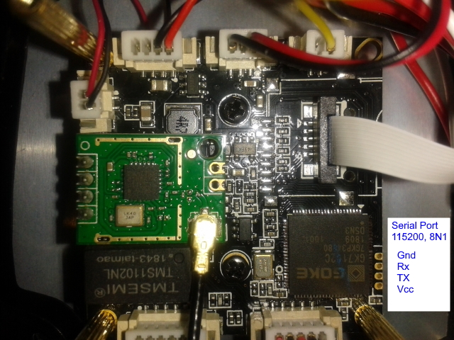

# Hacking my GK7102 Cloud Cameras (in progress) 

*_A cheap cloud camera, and my workarounds to close security holes_*

_Pete Wentworth_    mailto:cspwcspw@gmail.com  

## Overview

I bought a few of these $30 unbranded [HD outdoor cloud cameras from Banggood](https://www.banggood.com/HD-1080P-WiFi-Security-IP-Camera-CCTV-IP66-Waterproof-for-Outdoor-Indoor-p-1424556.html).


 
They can do 1280x720 at 12fps, they 
have two-way sound/voice, night IR 
lights, additional white LEDs, an IR-Cut filter they can take 
an SD card for extra storage and 
recordings, can be used wired or wirelessly. They don't have Pan, Tilt, 
or Zoom (PTZ). The advert claims to deliver h265 compressed streams. I have
seen an HEVC stream described by FFMPEG, but have only seen h264 on my viewers.

Being a Cloud Camera, instructions are 
to use the YCC365 app, create a cloud account, configure the camera 
with my WiFi credentials, and manage it via my phone.  The cloud 
service provides remote viewing with alerts and some storage of motion 
clips. Cloud services are free for a trial period.  

But the security risks of having it on my home network with 
a cloud connection are widely recognized 
e.g. https://www.tomsguide.com/us/iot-hack-tool-public,news-23579.html 

The two bits of common online advice are to throw them in the dustbin,
or to put them on an isolated network.  
I bought a second-hand ADSL 4-port router for less than $10 and built a 
"sandboxed network" for my cameras.
   
At the edge of my sandbox network is my gateway computer 
which also connects to my primary home network, but it 
won't forward traffic between the cameras and the internet. 
 
I use the free [iSpy](https://www.ispyconnect.com/) on the 
gateway computer to view the streams, and 
record clips when there is motion or noise, etc.  I can 
connect to __iSpy__ from my home network, and with a bit of 
magic port-forwarding in my primary home router I can 
access the cameras in a more secure way from outside the home.

Out-of-the-box the camera is willing to deliver RTSP 
streams over the wired LAN, and has some limited Onvif support.

But not so over the wireless connection, unless it has been 
configured and registered 
to its cloud mother-ship.  (It will, however, default to 
become a wireless access point, so you could directly link 
your PC or phone to the AP and view the stream.  I don't 
pursue that option here.)

So most of this document is about what I found on the camera, 
and a few work-arounds I achieved. Many of what I consider 
"risky" looking processes and open ports are still open, 
running, and still looking risky on the camera: but I'm 
relying on the gateway to keep the dangerous-looking cameras 
mostly functional, but sandboxed.

Some of the camera control that I might be able to do via the 
cloud and the control app, are not yet achieved. 
 
## Out of the box: Get its video stream working

On a wired connection the camera uses DHCP to 
get an IP address.  I like to have the same IP address 
every time (for __iSpy__ convenience), so the first job 
is to reserve a known IP address for the camera's 
MAC address.  The MAC is printed on a QR code on the 
side of the camera.  So log onto the sandbox router, 
make sure DHCP is enabled, reserve an address for the 
camera, let's say `192.168.0.237`. Perhaps also reserve an 
address for your gateway PC LAN connection too.   
Lets say `192.168.0.20`.   (Find the gateway machine's MAC - 
on Windows, in a command window, `ipconfig`, on linux  `ifconfig`).  

Plug the camera and the PC into the router using LAN 
cables, switch the camera on.  It seems to find its 
way to a wired connection after a minute or so.  
`ping -t 192.168.0.237` on Windows will continually ping, 
you will see when the camera starts responding,
Now let's find the stream.  There are many sites with 
common listings of usercode and password for accessing 
the stream, and your documentation in the box may give 
you this, but supplying *no credentials at all* seems to work here.
Otherwise (user `admin`, no password).   
So in __iSpy__, add a new IP camera, use the FFMPEG tab and use 
this URL `rtsp://admin:@192.168.0.237`.

If testing the connection works, 
you've got the stream.  It seems that there are two underlying 
resolutions, plus audio, but a number of ways to get at them - 
the first three seem to be aliases.   All these work with either UDP or TCP.
```
rtsp://192.168.0.237/        – 1280x720 H.264 MPEG-4 AVC (part 10), 12fps, no sound
rtsp://192.168.0.237/onvif1  – 1280x720 H.264 MPEG-4 AVC (part 10), 12fps, no sound
rtsp://192.168.0.237/onvif2  – 1280x720 H.264 MPEG-4 AVC (part 10), 12fps, no sound
rtsp://192.168.0.237/0/av0   – 1280x720 stream with sound
rtsp://192.168.0.237/0/av1   –  640x360 stream with sound
rtsp://192.168.0.237/0/av2   –  640x360 stream with sound
rtsp://192.168.0.237/0/      –  stream without sound, size is a coin-flip! 
```
All the above streams also seem to respond to `ffprobe` at port 8001. 

In the __iSpy__ camera settings you can uncheck the __Resize__ 
option (this resizing happens on 
your gateway PC)  (middle-bottom of 
the __iSpy__ image is a pop-up toolbar with a settings icon), 
and then right-click the image and __Reset Size__ you'll see 
what size the camera is actually delivering.

## The camera does ONVIF, just a little ...

The free [ONVIF Device Manager](https://sourceforge.net/projects/onvifdm/) 
will detect the camera on your network (most of the time), and 
present its IP address, advertised capabilities, stream profiles, etc. 
in an easy-to-explore way.  Every attempt to edit any camera or stream setting 
via ONVIF simply crashed the camera or did not work.  

__iSpy__ can also interrogate and connect ONVIF cameras, and it will show
you three (sometimes only two) different ONVIF profiles. 
There is no profile via ONVIF that 
corresponds to /av0 above - i.e. full size with sound.  

Start by entering 
this URI in the ONVIF tab.  User codes and passwords do not seem to matter.

```
http://192.168.0.236/onvif/device_service 
```

## Does the camera already allow telnet logins? 
The camera runs a stripped down version of Linux. 
If it allows remote __telnet login__ you are probably in luck. 
 
If we can open a telnet session and find the correct password 
to log on as __root__ we have cracked the main security hurdle.
  
I use [PuTTy](https://www.putty.org/) on my Windows machine for Telnet sessions. 
If you get a login screen, great, it means the camera is running a 
server to allow remote sessions. 

I subsequently got a few more cameras, they came very 
slightly modified. The newer ones only
have two leads out the back: LAN and power.  There is no reset 
button like the earlier cameras. Additionally, in some situations it 
seems necessary to activate a video stream from the camera before 
the __telnet login__ will work. 

If __root__ with password __cxlinux__ works, you are in!  Here are 
some [other credentials you can try](https://ipvm.com/reports/ip-cameras-default-passwords-directory).

## What if telnet is not running, or I can't find the usercode and password?

You won't find much help in this document.  

However, a more 
sophisticated back-door attack might work.  This camera (and many 
others like it) allow you to insert an 
SD card.  During Linux start-up they look for and execute 
a debug script if it exists on the SD card. So that gives an attacker 
the opportunity to replace existing software, change passwords, etc.
Of course you could also make a mistake and brick your device. 
 
https://github.com/ant-thomas/zsgx1hacks has the detail, and uses this approach.


## Make a backup
Before you change anything, if you do have an SD card, boot the 
camera with the card installed and make some backups.  __df__  
will show free disk space, and the card will be obvious, with 
lots of free space.    The card should mount at  __/mnt/mmc01/0__   
The command 
  
```cp -r /home /mnt/mmc01/0```

should give you some backup security on your SD card. 

## Avoiding an address conflict
The arcane art of using the editor __vi__ is a step too far 
for this document - look it up somewhere!

We need to solve a new problem: the __/home/start.sh__ script 
steals the wi-fi MAC address and re-uses it for the LAN interface.  We
cannot have both a wired and a wireless connection to our 
sandbox using the same MAC, so we're going to get really dirty: 
we'll swap the first two MAC bytes before we set the MAC of 
the LAN (eth0) device. Using your __vi__ cheat-sheet, edit the file 
__start.sh__ and change the line 
```
MAC=`ifconfig | awk '/wlan0/{print $NF}'` 
```
to

```
# Pete: swap two bytes of MAC to ensure wired and wireless mac different
MAC=`ifconfig | awk '/wlan0/{print $NF}' | sed -e 's/20:32:33/32:20:33/'`
```
For interest, the first three bytes of a MAC are assigned to different vendors.  If your
camera's MAC does not start with 203233 - vendor reported as __Shenzhen__ by WireShark - 
then adapt the ``sed`` replacement string. Or someone should generalize my code.)

Now log on back to your sandbox router, and where you previously reserved an 
address for the old MAC, reserve another new address (I used `192.168.0.236` - just 
one ip address lower) for the new mac with the bytes swapped. 
(If the mac already reserved is `20:32:33:...` the new mac will be `32:20:33...`)

Now reboot the camera, (either a power cycle or a `reboot` command 
in the console window) and wait.   The MAC in the LAN 
interface will be different, it should be given the new 
IP address, and you should be able to ping the new address from the PC:
```
ping -t 192.168.0.236
```

Once this responds you can log on as `root` again, but this time using the new IP address.
Your video stream on __iSpy__ will no longer be working.  You can set up a second stream, like the first, at the new IP address.

## Getting the wireless connected to your own LAN

The __p2pcam__ software in a mother-ship configured cloud camera uses a 
file __/home/devParam.dat__ containing credentials for your wireless network.
Because the file appears to be digitally signed, 
editing it manually is futile.  So the trick is to make sure __p2pcam__
does not try to start the wireless network.  We'll start it ourselves, with our 
own configuration.

__p2pcam__ won't ordinarily try to bring up the wireless if the LAN
connection is present. 

Our next step is to create our 
own wireless config file for our sandbox network - 
we need to provide its *ssid* and *password*.
In folder `/home` there is a file 
called `wpa_supplicant.conf.EYERD` 
which you can copy and modify like this: 
```
cd /home
cp wpa_supplicant.conf.EYERD myown.conf 
```

Use `vi` to edit `myown.conf` and change credentials to 
your own sandbox router's ssid and password. 
  
Now get the wireless going, first manually,
by typing at the command line:

```
iwconfig   # optional, if you want to see wireless status 

wpa_supplicant -B -iwlan0 -c /home/myown.conf &

iwconfig   # may take some seconds to connect and show changed status
```

Once your camera and the sandbox 
router have agreed to talk to each other and negotiated
their encryption keys, you can ask the router 
for an IP address using dhcp on wlan0 like this: 
```
udhcpc -i wlan0
```

Now if all goes according to plan, you can open a second Windows 
command window and ping the wireless IP (the one at `...237`).  
Both the wired (at `...236`) and the wireless connection 
should now be responding independently.

And of course, in __iSpy__ you can now collect two different RTSP streams from the two
different IP addresses simultaneously. (Experiment with getting a low-res stream over wireless while you also get the hi-res stream over the wired connection.)

Now to make this automatic whenever the camera restarts, use __vi__ to add the following lines near the end of the __start.sh__ script, just before the last line that says `free`: 
```
# Bring up wireless supplicant using our own configuration file:
wpa_supplicant -B -iwlan0 -c /home/myown.conf &
sleep 30
# auto config via DHCP
udhcpc -i wlan0

free
```

Test this by rebooting the camera. It should come up with both wifi and 
LAN connections working on different IP addresses.


## Do I have to have this wired LAN cable?

So far, my software won't get going unless it thinks there is a wired connection, 
and only then can we get the wireless going.   So if we don't want the 
pesky LAN cable, we need to fool it. 
 
One way to do so is to use an *Ethernet Loopback Plug* which can plug into 
the Ethernet connection on the camera.  (Google it, and look at the images.)
You can buy them or make your own.  
I simply cut an existing Ethernet cable in half, 
found the correct colour wires to join up, and made a DIY loopback plug 
from each end.  Images on Google show you which 
pins need to be bridged to which other ones.  

Rebooting the camera now overcomes the need for a LAN connection, 
but it still brings up the wireless connection.  
You should be able to view the streams at the wireless IP address 
using __iSpy__.  


And - whew! - we've never allowed the camera to connect to the Cloud.  

## A little monitoring 

The linux command `netstat -ap`  shows us that there are a number of 
ports listening for instructions from the big bad internet.  Some endpoints have really suspicious-sounding names, like `systemcall.sock`. 

So in your PC command window (on the PC, not on the camera), attach to the stream at port 3201 like this:
```
curl 192.168.0.237:3201
```

and watch some logging information.  Move in front of your camera, s
or create loud sounds to see motion and sound events from the camera.  

You'll also notice the camera is creating a lot of failed attempts to get 
an IP address for its wired LAN (because you have fooled with the dumb
Ethernet Loopback Plug).  You can quieten the logging down a bit 
by adding yet another line to the `start.sh` script before the end, 
and restarting the camera:
```
ifconfig eth0 down   # Take the LAN down now that the wireless is up.
```

## The GPIO pins

Microprocessors have GPIO pins that can be used for input or output.  

So the file `/home/hardinfo.bin` tells us (among other things) 
```
<GPIO>
<BoardReset>16_0x00000000_0_0</BoardReset>
<SpeakerCtrl>-1</SpeakerCtrl>
<IrFeedback>0</IrFeedback>
<BlueLed>-1</BlueLed>
<RedLed>-1</RedLed>
<IrCtrl>6_0x00000000_0_1</IrCtrl>
<IrCut1B>14_0x00000000_0_1</IrCut1B>
<IrCut2B>17_0x00000000_0_1</IrCut2B>
<WhiteLight>9_0x00000000_0_1</WhiteLight>
</GPIO>

```
Pins 6 and 9 control the IR or daylight LEDs on the camera.  
So on the camera command line ... 
``` 
gio -s 9 1  // Daylight leds are controlled by pin number 9.  1=on, 0=off
gio -s 6 1  // IR leds   1=on, 0=off
```
The camera also has an IR-Cut feature to filter out IR for better viewing
during daytime, and to allow IR to pass to the sensor for better viewing at night. 
There are two GPIO pins that seem to be used in tandem. Google says
IR filters are mechanical: a relay or electromagnet that physically moves
the filter in front of the lens.  It seems that pins 14 and 17 have to be 
in opposite states (maybe the flow of current reverses) to effect change.
So watch your video feed in __iSpy__, while you try this:
```
# Seems to takes the IR filter out, image goes pink in my artificial lighting!
gio -s 17 1 && gio -s 14 0  
# Make IR filter active 
gio -s 17 0 && gio -s 14 1  
```
And just in case this is all about current flowing between the pins,
set them both to the same logic level in "rest" state.
```
gio -s 17 0 && gio -s 14 0
```

## Take a snapshot 
### From a browser
http://192.168.0.237:554/snapshot 

### From the Windows command line, download a snapshot
```
curl -v --output snapshot.png 192.168.0.237:554/snapshot
```

## Disable AP Mode

Untested: prevent the camera from becoming an access point by changing the line in `/home/hwcfg.ini`

## General Observations

Using the camera off-line or in pure LAN-connected mode delivers 
good streams, but lack of control of the camera is an issue. In a 
field test it seems too sensitive to its three different
lighting modes.  Each time it switches on the daylight LEDs or 
removes and inserts the daylight filters, the image changes dramatically,
and the ```iSpy``` software sees that as motion detection.   

Also, ```iSpy``` lets me define regions of interest for triggering
motion detection.  But without knowing how to set similar regions
on the camera, I'm getting too many daylight / night filter switches.

I believe there are some settings in the configuration that I can still
explore, for example if I give it the wrong GPIO pin for the LEDs I can 
probably disable the mechanism.  And there are some sensitivity settings,
etc. that might help turn the camera back into a "just deliver your stream,
switch off your own AI".

With the camera offline on a local LAN, the monitor stream at port 3201 
shows the message ```sync time failed``` approximately once per second.   
This coincides with the camera delivering a "dirty" image in the 
stream - visually noticeable. 
Everything appears a bit more blurry than normal 
(perhaps fewer bits weere used to compress the frame?).  
In ```iSpy``` it can be highlighted by not suppressing noise, and showing 
where ```iSpy``` has detected motion. 


## Specifications

An unbranded camera!  But it is made up of hardware, firmware, etc,
all possibly from different companies. 

The file `/home/hardinfo.bin` tells us something about the hardware ...
```
<DeviceInfo version="1.0">
<DeviceClass>0</DeviceClass>
<OemCode>0</OemCode>
<BoardType>1010</BoardType>
<FirmwareIdent>eyeplus_ipc_gk_004</FirmwareIdent>
<Manufacturer>KAIZE</Manufacturer>
<Model>GK7102</Model>
<WifiChip>RTL8188</WifiChip>
```
So the camera board is a popular Goke GK7102.  It is amazing just
how much you can buy for $30.
http://www.goke.com/en/index.php?g=home&m=products&a=show&id=14 

Here are some hacks:
https://github.com/edsub/Goke_GK7102 


You can also glean some information by looking through the file `/tmp/closelicamera.log` 


The camera sensor (which is on the GK7102 camera board) defines the resolution.  Running
`sensordetect` will show you interesting stuff before the camera resets itself!

```
/home/sensordetect
GOKE ADI: R(12890) LIBC(uClibc) (gcc version 4.6.1 (crosstool-NG 1.18.0) ) 2017-10-20 10:36:45
find:gc1034 at 0x42

[OpenCore.cpp(220) PrintVersionInfo]Trace: SDKs version: P2P(1.1.3.7.000 - May 21 2018 20:57:31) ESD(LECAM_SDK_1.0.3.11) UPNS(UPNS_SDK_2.0.3.2)

```
The gc1034 sensor is described as `HD, 1280x720, 1/4", pixel size 3um, interface DVP/MIPI`  at http://www.gcoreinc.com/product1/show.php?lang=en&id=139 

The camera board seems to be `GOKE 710S, BOARD 20190215` so this date seems quite recent.  

```
more /etc/init.d/rcS

https://github.com/edsub/Goke_GK7102
```

```
busybox  # announces itself as v1.22.1 
...
lsmod
    Tainted: P
8188fu 932958 0 - Live 0x7f0b2000 (O)           -- Realtek WiFi
gio 1587 1 - Live 0x7f0ae000 (O)
exfat 88974 1 - Live 0x7f093000 (O)
gc1034_ex 12786 0 - Live 0x7f08c000 (O)
sensor 163356 1 gc1034_ex, Live 0x7f061000 (PO)
audio 8700 4 - Live 0x7f05b000 (PO)
media 271190 7 sensor, Live 0x7f010000 (PO)
hw_crypto 1948 1 media, Live 0x7f00c000 (PO)
hal 31987 1 media, Live 0x7f000000 (PO)
```

 
## Loose Ends 

This from https://github.com/ant-thomas/zsgx1hacks 
```
PORT     STATE SERVICE
23/tcp   open  telnet
80/tcp   open  http
554/tcp  open  rtsp
843/tcp  open  unknown
3201/tcp open  monitor events occurring on the camera 
5050/tcp open  multimedia conference control tool
6670/tcp open  irc
7101/tcp open  elcn
7103/tcp open  unknown
8001/tcp open  vcom-tunnel

```
In closecli.log I find some hints about two UDP ports.  (216 is the PID, not running now). But ports are shown owned by p2pcam process)
```
	Line 155: [216] [APDirectConnect.cpp(152) bindUdpPort]Trace: udp bind port-9999 success.
	Line 156: [216] [APDirectConnect.cpp(174) bindUdpPort]Trace: udp bind port-8888 success.
```
 
Also, process 363 is not running now. Neither do I see open ports at 5050. 

```
    
    Line 1618:  [363] [InLanPlay.cpp(284) sTimerProc]Trace: Begin___
	Line 1619:  [363] [InLanPlay.cpp(169) UpdateAuthKey]Trace: Begin___
	Line 1620:  [363] [InLanPlay.cpp(115) GetInlanValue]Trace: inlan value=43200*192.168.0.235*5050*http://192.168.0.235/?.
	Line 1621:  [363] [InLanPlay.cpp(177) UpdateAuthKey]Trace: inlanPlay string: 43200*192.168.0.235*5050*http://192.168.0.235/?
	Line 1621:  [363] [InLanPlay.cpp(177) UpdateAuthKey]Trace: inlanPlay string: 43200*192.168.0.235*5050*http://192.168.0.235/?
	Line 1622:  [363] [InLanPlay.cpp(211) UpdateAuthKey]Trace: local ip port is : 192.168.0.235:5050
	Line 1623:  [363] [InLanPlay.cpp(234) UpdateAuthKey]Trace: AuthKey is: 108258
	Line 1625:  [363] [InLanPlay.cpp(277) UpdateAuthKey]Trace: End___, Set timer(30 secs)
 ```
## Bricking the camera

I managed to brick one the cameras with a silly oversight.  
I copied a modified but working ``start.sh`` from one 
camera via an ftp site, to another.  I used ``ftpput`` from the source 
camera, and then did ``ftpget`` from the target system to install it.  
But it lost execute permissions along the way, 
and I forgot to set them again.  So it probably boots 
and then isn't able to run ``start.sh``, 
and I can't find a way to connect to it. 

Can I find any place to attach a tty? 

Yay! I got it unbricked. wyatt303 and TimelessNL identified what 
they thought were serial port pads. I read 
http://www.devttys0.com/2012/11/reverse-engineering-serial-ports/   
and yes, was 
able to connect via a USB to Serial adapter to my laptop, and use
PuTTy to log in as root and fix my broken permissions.  So the 
camera is now unbricked. Thanks, guys!

The pin mapping and the baudrate setting are overlayed in the pics below.

With the additional serial port breakout on this camera I've put it
on my desk as my "test more ideas" camera.  Watching the console at
boot and initialization time gives me more information than I can
get otherwise.


## What's inside the housing?

Here are a couple of photos.  The camera build quality looks great.
But it is hard to photograph, as there are three stacked boards, with the most
important one being inaccessible, at the bottom.  
 


Three stacked boards:


The top layer has the SDXC reader, an intriguing push-switch 
(I tried booting while holding the switch, etc.) and a two-pin header.
I wonder if the switch might make the camera boot from an image 
on the SD card?  I tried to boot with a Raspberry PI SD card, but
to no avail.   


The middle layer looks like power conditioning and some stuff that
makes the "click" sounds when the LED and infrared lights turn on and off.


The lowest layer board has an SoC called GOKE7102C.  It also contains a 
TMS1102NL which is apparently a magnet isolation and interference suppression
device for 10Base-T Ethernet.  There is also the green wireless daughterboard 
with the bright yellow antenna plug. 




## Help?

Please let me know if you stumble across anything that will allow me to 
control the PSPCamera hardware: change the stream frame rate, 
control the LEDs remotely, set regions of interest for motion 
detection, or speak back through the camera. 

*Last Revision 10 September 2019*  
mailto:cspwcspw@gmail.com 